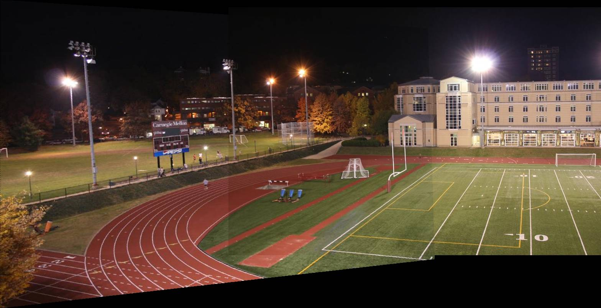

# Image Stitching Using Numpy and cv.SIFT

Usage: `python image-stitching.py <datasetpath>/im1.jpg <datasetpath>/im2.jpg <datasetpath>/im3.jpg ...`

## Sample Output

`python image-stitching.py sample/im89.jpg sample/im90.jpg`

| Image 1 | Image 2 | Output |
| ------- | ------- | ------ |
|  |  |  | 
